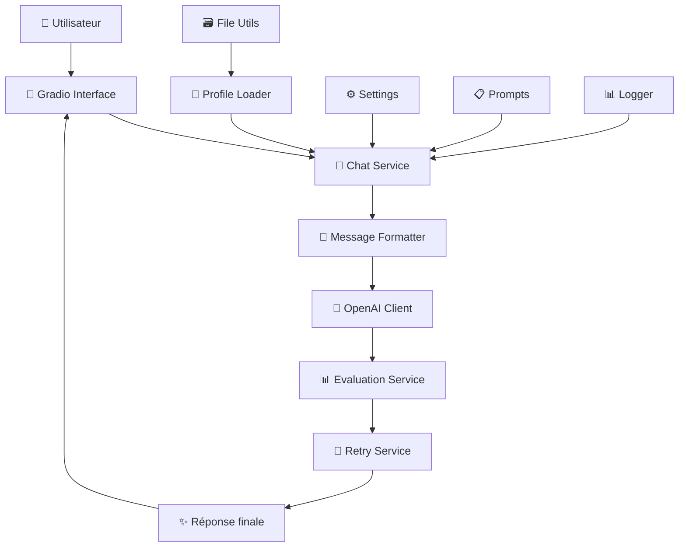

# 🤖 Raphaël PICARD - AI Assistant

Un assistant IA personnel basé sur OpenAI GPT-4 et Gemini, avec une architecture modulaire et des fonctionnalités avancées d'évaluation et de retry.

## 🚀 Fonctionnalités

- 💬 **Chat interactif** avec interface Gradio élégante
- 🔄 **Système de retry intelligent** avec stratégies multiples
- 📊 **Évaluation automatique** des réponses avec Gemini
- 🎯 **Profil personnalisé** basé sur CV et informations LinkedIn
- ⚙️ **Configuration flexible** via variables d'environnement
- 📈 **Logging et métriques** pour monitoring
- 🏗️ **Architecture modulaire** pour faciliter la maintenance

## 📋 Prérequis

- Python 3.8+
- Clés API OpenAI et Google (Gemini)
- Fichiers de profil (PDF LinkedIn, résumé texte)

## 🛠️ Installation

### 1. Cloner et naviguer

```bash
git clone git@github.com:PicardRaphael/chat-bot.git
cd chat-bot/
```

### 2. Installer les dépendances

```bash
pip install -r requirements.txt
```

### 3. Configuration des variables d'environnement

Créer un fichier `.env` :

```bash
# API Keys (obligatoires)
OPENAI_API_KEY=sk-...
GOOGLE_API_KEY=...

# Configuration optionnelle
CHAT_MODEL=gpt-4o-mini
EVALUATION_MODEL=gemini-2.0-flash
PROFILE_DIR=raph/files
LOG_LEVEL=INFO
```

### 4. Préparer les fichiers de profil

Placer dans le dossier `raph/files/` :

- `linkedin.pdf` : Export du profil LinkedIn en PDF
- `summary.txt` : Résumé personnel en texte

## 🚀 Utilisation

### Interface simple

```bash
python main.py
```

### Interface avancée avec onglets

```bash
python main.py --advanced
```

### Options de ligne de commande

```bash
python main.py --help

Options:
  --advanced    Interface avancée avec configuration et métriques
  --share       Créer un lien public Gradio
  --port 8080   Port personnalisé (défaut: 7860)
  --host 0.0.0.0  Host personnalisé (défaut: 127.0.0.1)
```

### Exemples d'utilisation

```bash
# Interface simple sur localhost
python main.py

# Interface avancée avec partage public
python main.py --advanced --share

# Interface sur le réseau local, port 8080
python main.py --host 0.0.0.0 --port 8080
```

## 🏗️ Architecture

### Structure du projet

```
raph/
├── 📁 config/                 # Configuration
│   ├── __init__.py
│   ├── settings.py            # Variables d'environnement centralisées
│   └── prompts.py             # Templates de prompts
├── 📁 core/                   # Logique métier centrale
│   ├── __init__.py
│   ├── models.py              # Classes Pydantic (données structurées)
│   ├── profile_loader.py      # Chargement des données de profil
│   └── message_formatter.py   # Formatage des messages OpenAI
├── 📁 services/               # Services métier
│   ├── __init__.py
│   ├── services/chat_service.py        # Service principal de chat
│   ├── evaluation_service.py  # Évaluation des réponses
│   └── retry_service.py       # Stratégies de retry intelligentes
├── 📁 api/                    # Clients API
│   ├── __init__.py
│   ├── openai_client.py       # Client OpenAI configuré
│   └── gemini_client.py       # Client Gemini pour évaluation
├── 📁 ui/                     # Interface utilisateur
│   ├── __init__.py
│   └── gradio_interface.py    # Interface Gradio complète
├── 📁 utils/                  # Utilitaires
│   ├── __init__.py
│   ├── file_utils.py          # Lecture de fichiers (PDF, texte)
│   └── logger.py              # Configuration des logs
├── 📄 main.py                 # Point d'entrée principal
├── 📄 requirements.txt        # Dépendances Python
├── 📄 test_tasks.py          # Tests de validation
└── 📄 README.md              # Cette documentation
```

### Flux de données



## 🧩 Composants principaux

### 💬 Chat Service

Service principal qui orchestre la génération de réponses :

- Intégration avec le profil utilisateur
- Gestion des prompts système
- Pipeline complet : génération → évaluation → retry si nécessaire

### 🔄 Retry Service

Système intelligent de retry avec plusieurs stratégies :

- **SINGLE** : Une seule tentative de retry
- **MULTIPLE** : Plusieurs tentatives avec évaluation
- **PROGRESSIVE** : Délais progressifs entre tentatives
- **BEST_OF_N** : Génère N réponses et sélectionne la meilleure

### 📊 Evaluation Service

Évaluation automatique des réponses via Gemini :

- Critères de qualité personnalisables
- Feedback détaillé pour amélioration
- Sélection automatique des meilleures réponses

### 🎨 Gradio Interface

Interface utilisateur avec deux modes :

- **Simple** : Chat basique et épuré
- **Avancé** : Onglets avec configuration et métriques

## ⚙️ Configuration

### Variables d'environnement

| Variable            | Description                      | Défaut             |
| ------------------- | -------------------------------- | ------------------ |
| `OPENAI_API_KEY`    | Clé API OpenAI                   | _(obligatoire)_    |
| `GOOGLE_API_KEY`    | Clé API Google                   | _(obligatoire)_    |
| `CHAT_MODEL`        | Modèle OpenAI pour le chat       | `gpt-4o-mini`      |
| `EVALUATION_MODEL`  | Modèle Gemini pour l'évaluation  | `gemini-2.0-flash` |
| `PROFILE_DIR`       | Dossier des fichiers de profil   | `raph/files`       |
| `MAX_RETRIES`       | Nombre maximum de retry          | `3`                |
| `ENABLE_EVALUATION` | Activer l'évaluation automatique | `True`             |
| `LOG_LEVEL`         | Niveau de logging                | `INFO`             |

### Fichiers de configuration

- `.env` : Variables d'environnement
- `config/settings.py` : Configuration centralisée
- `config/prompts.py` : Templates de prompts personnalisables

## 🧪 Tests et validation

### Lancer les tests

```bash
python test_tasks.py
```

Les tests valident :

- ✅ Configuration et chargement des settings
- ✅ Fonctionnement des services (chat, évaluation, retry)
- ✅ Intégration des clients API
- ✅ Interface Gradio
- ✅ Formatage des messages
- ✅ Chargement du profil

### Tests de performance

Les tests incluent la validation des métriques :

- Temps de réponse
- Taux de succès des retry
- Qualité des évaluations

## 📊 Monitoring et logs

### Structure des logs

```
2025-06-26 10:57:16 [INFO] raph_chatbot: 🚀 Starting: chat operation
2025-06-26 10:57:16 [INFO] raph_chatbot: ✅ Completed: chat operation
```

### Métriques disponibles

- **Temps de réponse** moyen par requête
- **Taux de succès** des évaluations
- **Nombre de retry** par conversation
- **Performance** des différents modèles

### Context managers pour le logging

```python
from utils.logger import LogContext, EvaluationLogContext

# Logging d'opération
with LogContext("chat_generation"):
    response = generate_response(message)

# Logging d'évaluation
with EvaluationLogContext("user_message", response, True):
    # Évaluation automatiquement loggée
    pass
```

## 🔧 Personnalisation

### Ajouter un nouveau modèle

1. Modifier `config/settings.py` :

```python
CHAT_MODEL: str = "gpt-4o"  # Nouveau modèle
```

2. Redémarrer l'application

### Personnaliser les prompts

Modifier `config/prompts.py` :

```python
SYSTEM_PROMPT = """
Vous êtes un assistant personnalisé pour {name}.
[Votre prompt personnalisé ici]
"""
```

### Ajouter une nouvelle stratégie de retry

1. Modifier `services/retry_service.py`
2. Ajouter la stratégie dans `RetryStrategy` enum
3. Implémenter la logique dans `retry_with_strategy()`

## 🐛 Dépannage

### Problèmes courants

**Erreur "API key not found"**

- Vérifier le fichier `.env`
- S'assurer que les clés API sont valides

**Erreur "Profile files not found"**

- Vérifier la présence de `linkedin.pdf` et `summary.txt` dans `raph/files/`
- Contrôler le chemin dans `PROFILE_DIR`

**Interface Gradio ne démarre pas**

- Vérifier que le port n'est pas déjà utilisé
- Essayer avec `--port 8080`

### Logs de débogage

Activer le mode debug :

```bash
export LOG_LEVEL=DEBUG
python main.py
```

### Tests de connectivité

```python
from api.openai_client import get_openai_client
from api.gemini_client import get_gemini_client

# Test OpenAI
openai_client = get_openai_client()
print(openai_client.test_connection())

# Test Gemini
gemini_client = get_gemini_client()
print(gemini_client.test_connection())
```

## 🚀 Développement

### Ajouter une nouvelle fonctionnalité

1. **Service** : Créer dans `services/`
2. **Modèles** : Ajouter dans `core/models.py`
3. **Tests** : Ajouter dans `test_tasks.py`
4. **Interface** : Modifier `ui/gradio_interface.py`

### Structure recommandée pour un nouveau service

```python
"""Module de description du service."""

from typing import Optional
from utils.logger import logger
from config.settings import settings

class MonService:
    """Description du service."""

    def __init__(self):
        """Initialisation."""
        self.setting = settings.MON_SETTING
        logger.debug("MonService initialized")

    def ma_methode(self) -> str:
        """Description de la méthode."""
        try:
            # Logique ici
            return "résultat"
        except Exception as e:
            logger.error(f"Erreur dans ma_methode: {e}")
            raise

# Singleton pattern
_mon_service: Optional[MonService] = None

def get_mon_service() -> MonService:
    """Obtenir l'instance singleton."""
    global _mon_service
    if _mon_service is None:
        _mon_service = MonService()
    return _mon_service
```

## 📄 Licence

Ce projet est un assistant personnel et n'est pas destiné à un usage commercial.

## 👤 Auteur

**Raphaël PICARD**

- Assistant IA personnel développé pour optimiser les interactions et fournir des réponses contextuelles basées sur le profil professionnel.

---

_Documentation générée automatiquement lors du refactoring - Phase 5 complète_ ✨
