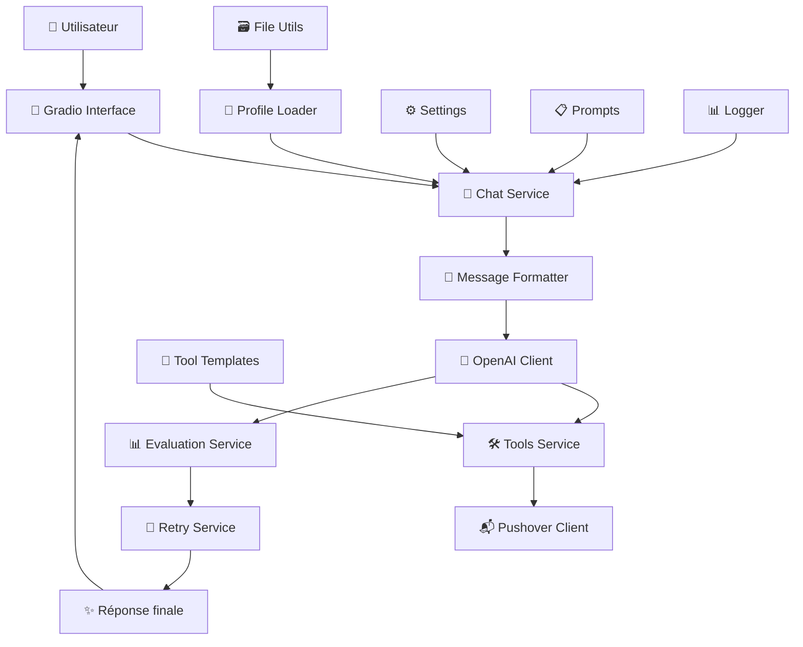
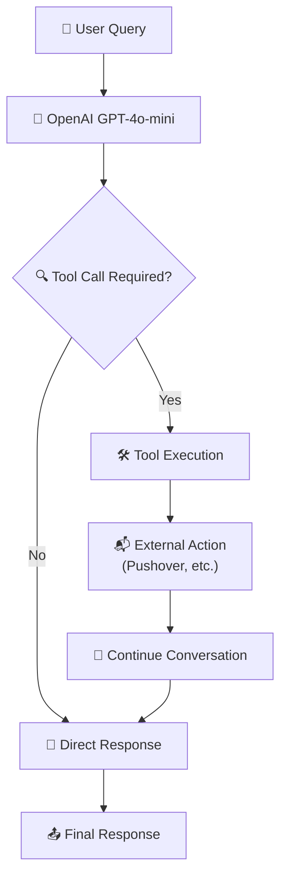
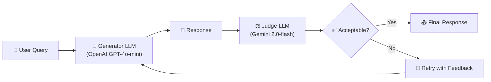

# 🤖 Raphaël PICARD - AI Assistant

Un assistant IA personnel basé sur OpenAI GPT-4 et Gemini, avec une architecture modulaire et des fonctionnalités avancées d'évaluation et de retry.

## 🚀 Fonctionnalités

- 💬 **Chat interactif** avec interface Gradio élégante
- 🔄 **Système de retry intelligent** avec stratégies multiples
- 📊 **Évaluation automatique** des réponses avec Gemini
- 🎯 **Profil personnalisé** basé sur CV et informations LinkedIn
- 🛠️ **Function Calling & Tools** - Système de tools automatiques
- 📬 **Notifications Pushover** pour enregistrer les questions inconnues
- ⚙️ **Configuration flexible** via variables d'environnement
- 📈 **Logging et métriques** pour monitoring
- 🏗️ **Architecture modulaire** pour faciliter la maintenance

## 📋 Prérequis

- Python 3.8+
- Clés API OpenAI et Google (Gemini)
- Fichiers de profil (PDF LinkedIn, résumé texte)

## 🛠️ Installation

### 1. Cloner et naviguer

```bash
git clone git@github.com:PicardRaphael/chat-bot.git
cd chat-bot/
```

### 2. Installer les dépendances

```bash
pip install -r requirements.txt
```

### 3. Configuration des variables d'environnement

Créer un fichier `.env` :

```bash
# API Keys (obligatoires)
OPENAI_API_KEY=sk-...
GOOGLE_API_KEY=...

# Pushover (pour tools/notifications)
PUSHOVER_USER=your_pushover_user_key
PUSHOVER_TOKEN=your_pushover_app_token

# Configuration optionnelle
CHAT_MODEL=gpt-4o-mini
EVALUATION_MODEL=gemini-2.0-flash
PROFILE_DIR=raph/files
LOG_LEVEL=INFO
```

### 4. Préparer les fichiers de profil

Placer dans le dossier `raph/files/` :

- `linkedin.pdf` : Export du profil LinkedIn en PDF
- `summary.txt` : Résumé personnel en texte

## 🚀 Utilisation

### Interface simple

```bash
python main.py
```

### Interface avancée avec onglets

```bash
python main.py --advanced
```

### Options de ligne de commande

```bash
python main.py --help

Options:
  --advanced    Interface avancée avec configuration et métriques
  --share       Créer un lien public Gradio
  --port 8080   Port personnalisé (défaut: 7860)
  --host 0.0.0.0  Host personnalisé (défaut: 127.0.0.1)
```

### Exemples d'utilisation

```bash
# Interface simple sur localhost
python main.py

# Interface avancée avec partage public
python main.py --advanced --share

# Interface sur le réseau local, port 8080
python main.py --host 0.0.0.0 --port 8080
```

## 🏗️ Architecture

### Structure du projet

```
raph/
├── 📁 config/                 # Configuration
│   ├── __init__.py
│   ├── settings.py            # Variables d'environnement centralisées
│   ├── prompts.py             # Templates de prompts
│   └── pushover.py            # Templates des tools Pushover
├── 📁 core/                   # Logique métier centrale
│   ├── __init__.py
│   ├── models.py              # Classes Pydantic (données structurées)
│   ├── profile_loader.py      # Chargement des données de profil
│   └── message_formatter.py   # Formatage des messages OpenAI
├── 📁 services/               # Services métier
│   ├── __init__.py
│   ├── chat_service.py        # Service principal de chat
│   ├── evaluation_service.py  # Évaluation des réponses
│   ├── retry_service.py       # Stratégies de retry intelligentes
│   └── tools_service.py       # Orchestrateur des tools/function calling
├── 📁 api/                    # Clients API
│   ├── __init__.py
│   ├── openai_client.py       # Client OpenAI configuré
│   ├── gemini_client.py       # Client Gemini pour évaluation
│   └── pushover_client.py     # Client Pushover pour notifications
├── 📁 ui/                     # Interface utilisateur
│   ├── __init__.py
│   └── gradio_interface.py    # Interface Gradio complète
├── 📁 utils/                  # Utilitaires
│   ├── __init__.py
│   ├── file_utils.py          # Lecture de fichiers (PDF, texte)
│   └── logger.py              # Configuration des logs
├── 📄 main.py                 # Point d'entrée principal
├── 📄 requirements.txt        # Dépendances Python
├── 📄 test_tasks.py          # Tests de validation
└── 📄 README.md              # Cette documentation
```

### Flux de données



## 🧩 Composants principaux

### 💬 Chat Service

Service principal qui orchestre la génération de réponses :

- Intégration avec le profil utilisateur
- Gestion des prompts système
- Pipeline complet : génération → évaluation → retry si nécessaire

### 🔄 Retry Service

Système intelligent de retry avec plusieurs stratégies :

- **SINGLE** : Une seule tentative de retry
- **MULTIPLE** : Plusieurs tentatives avec évaluation
- **PROGRESSIVE** : Délais progressifs entre tentatives
- **BEST_OF_N** : Génère N réponses et sélectionne la meilleure

### 📊 Evaluation Service

Évaluation automatique des réponses via Gemini :

- Critères de qualité personnalisables
- Feedback détaillé pour amélioration
- Sélection automatique des meilleures réponses

### 🎨 Gradio Interface

Interface utilisateur avec deux modes :

- **Simple** : Chat basique et épuré
- **Avancé** : Onglets avec configuration et métriques

## 🛠️ Système de Tools (Function Calling)

L'assistant intègre un système de **function calling** permettant à l'IA d'exécuter automatiquement des actions externes en fonction du contexte de la conversation.

### 🎯 Fonctionnement



### 📋 Tools disponibles

| Tool                      | Déclencheur                                | Action                                    |
| ------------------------- | ------------------------------------------ | ----------------------------------------- |
| `record_unknown_question` | Question sans réponse connue               | 📬 Notification Pushover de la question   |
| `record_user_details`     | Utilisateur fournit email/infos de contact | 📬 Notification Pushover avec les détails |

### ⚙️ Configuration des Tools

#### Variables d'environnement requises

Ajouter dans votre fichier `.env` :

```bash
# Pushover (pour notifications)
PUSHOVER_USER=your_pushover_user_key
PUSHOVER_TOKEN=your_pushover_app_token
```

#### Obtenir les clés Pushover

1. **Créer un compte** sur [pushover.net](https://pushover.net)
2. **User Key** : Disponible sur le dashboard principal
3. **App Token** : Créer une nouvelle application dans "Your Applications"

### 📬 Tools Pushover

#### `record_unknown_question`

**Déclenchement automatique** :

- L'IA ne connaît pas la réponse à une question
- Information non présente dans le profil/CV
- Question sortant du domaine de compétence

**Exemple** :

```
User: "Quel est ton film préféré ?"
IA: "Je ne trouve pas cette information dans mon profil. Laisse-moi enregistrer cette question..."
🔧 Tool Call → record_unknown_question("Quel est ton film préféré ?")
📬 Pushover → "Recording question asked that I couldn't answer: Quel est ton film préféré ?"
```

#### `record_user_details`

**Déclenchement automatique** :

- Utilisateur partage son email
- Demande de contact ou collaboration
- Intérêt exprimé pour un projet

**Exemple** :

```
User: "Je suis intéressé par ton profil, mon email est john@example.com"
🔧 Tool Call → record_user_details(email="john@example.com", name="John", notes="Intérêt pour le profil")
📬 Pushover → "Recording interest from John with email john@example.com and notes Intérêt pour le profil"
```

### 🏗️ Architecture des Tools

```
services/
├── tools_service.py         # Orchestrateur principal des tools
api/
├── pushover_client.py       # Client Pushover
config/
├── pushover.py             # Templates des tools Pushover
```

#### Structure d'un Tool

Format OpenAI Function Calling :

```json
{
  "type": "function",
  "function": {
    "name": "record_unknown_question",
    "description": "Always use this tool to record any question that couldn't be answered",
    "parameters": {
      "type": "object",
      "properties": {
        "question": {
          "type": "string",
          "description": "The question that couldn't be answered"
        }
      },
      "required": ["question"]
    }
  }
}
```

### 🔧 Ajouter de nouveaux Tools

#### 1. Créer le client API

```python
# api/mon_service_client.py
class MonServiceClient:
    def execute_tool(self, tool_name: str, **kwargs) -> dict:
        if tool_name == "mon_action":
            return self.mon_action(**kwargs)

    def mon_action(self, param1: str) -> dict:
        # Logique d'exécution
        return {"success": True}

    def mon_service_tools(self) -> List[Dict[str, Any]]:
        return [
            {
                "type": "function",
                "function": {
                    "name": "mon_action",
                    "description": "Description de l'action",
                    "parameters": {
                        "type": "object",
                        "properties": {
                            "param1": {
                                "type": "string",
                                "description": "Description du paramètre"
                            }
                        },
                        "required": ["param1"]
                    }
                }
            }
        ]
```

#### 2. Intégrer dans ToolsService

```python
# services/tools_service.py
def __init__(self):
    self.pushover_client = get_pushover_client()
    self.mon_service_client = get_mon_service_client()  # Nouveau

def get_all_tools(self):
    tools = []
    # Pushover tools
    tools.extend(self.pushover_client.pushover_tools())
    # Nouveaux tools
    tools.extend(self.mon_service_client.mon_service_tools())
    return tools
```

### 🐛 Dépannage des Tools

#### Erreurs courantes

**"Missing required parameter: 'tools[0].type'"**

- Vérifier le format JSON des tools
- S'assurer que `"type": "function"` est présent

**"Tool execution failed"**

- Vérifier les variables d'environnement (PUSHOVER_USER, PUSHOVER_TOKEN)
- Contrôler les logs pour identifier l'erreur spécifique

**Tools non appelés**

- Vérifier que les tools sont bien chargés avec `get_all_tools()`
- S'assurer que le prompt système encourage l'utilisation des tools

#### Tests de validation

```python
# Test des tools
from services.tools_service import get_all_tools, execute_tool

# Vérifier le chargement
tools = get_all_tools()
print(f"Tools disponibles: {len(tools)}")

# Test d'exécution
result = execute_tool("record_unknown_question", question="Test question")
print(f"Résultat: {result}")
```

## 🏛️ Architecture : LLM-as-a-Judge

Ce système implémente le pattern **"LLM-as-a-Judge with Retry Logic"**, une architecture robuste utilisée dans les systèmes de production pour garantir la qualité des réponses.

### Principe de fonctionnement



### Avantages de cette approche

- **🎯 Qualité garantie** : Double validation par des modèles différents
- **🔄 Auto-correction** : Amélioration itérative avec feedback
- **⚖️ Réduction des biais** : Validation croisée entre modèles
- **📊 Métriques** : Traçabilité complète du processus

### Composants clés

| Rôle            | Modèle             | Responsabilité                         |
| --------------- | ------------------ | -------------------------------------- |
| **Generator**   | OpenAI GPT-4o-mini | Génère les réponses conversationnelles |
| **Judge**       | Gemini 2.0-flash   | Évalue la qualité et pertinence        |
| **Retry Logic** | Custom Service     | Orchestre les tentatives avec feedback |

### Pattern reconnu dans l'industrie

Cette architecture est également connue sous les noms :

- **LLM-as-a-Judge** (terme le plus courant)
- **Critic-Generator Architecture**
- **Multi-Model Validation**
- **Self-Correcting AI with External Judge**

## ⚙️ Configuration

### Variables d'environnement

| Variable            | Description                      | Défaut             |
| ------------------- | -------------------------------- | ------------------ |
| `OPENAI_API_KEY`    | Clé API OpenAI                   | _(obligatoire)_    |
| `GOOGLE_API_KEY`    | Clé API Google                   | _(obligatoire)_    |
| `PUSHOVER_USER`     | User Key Pushover pour tools     | _(optionnel)_      |
| `PUSHOVER_TOKEN`    | App Token Pushover pour tools    | _(optionnel)_      |
| `CHAT_MODEL`        | Modèle OpenAI pour le chat       | `gpt-4o-mini`      |
| `EVALUATION_MODEL`  | Modèle Gemini pour l'évaluation  | `gemini-2.0-flash` |
| `PROFILE_DIR`       | Dossier des fichiers de profil   | `raph/files`       |
| `MAX_RETRIES`       | Nombre maximum de retry          | `3`                |
| `ENABLE_EVALUATION` | Activer l'évaluation automatique | `True`             |
| `LOG_LEVEL`         | Niveau de logging                | `INFO`             |

### Fichiers de configuration

- `.env` : Variables d'environnement
- `config/settings.py` : Configuration centralisée
- `config/prompts.py` : Templates de prompts personnalisables

## 🧪 Tests et validation

### Lancer les tests

```bash
python test_tasks.py
```

Les tests valident :

- ✅ Configuration et chargement des settings
- ✅ Fonctionnement des services (chat, évaluation, retry)
- ✅ Intégration des clients API
- ✅ Interface Gradio
- ✅ Formatage des messages
- ✅ Chargement du profil

### Tests de performance

Les tests incluent la validation des métriques :

- Temps de réponse
- Taux de succès des retry
- Qualité des évaluations

## 📊 Monitoring et logs

### Structure des logs

```
2025-06-26 10:57:16 [INFO] raph_chatbot: 🚀 Starting: chat operation
2025-06-26 10:57:16 [INFO] raph_chatbot: ✅ Completed: chat operation
```

### Métriques disponibles

- **Temps de réponse** moyen par requête
- **Taux de succès** des évaluations
- **Nombre de retry** par conversation
- **Performance** des différents modèles

### Context managers pour le logging

```python
from utils.logger import LogContext, EvaluationLogContext

# Logging d'opération
with LogContext("chat_generation"):
    response = generate_response(message)

# Logging d'évaluation
with EvaluationLogContext("user_message", response, True):
    # Évaluation automatiquement loggée
    pass
```

## 🔧 Personnalisation

### Ajouter un nouveau modèle

1. Modifier `config/settings.py` :

```python
CHAT_MODEL: str = "gpt-4o"  # Nouveau modèle
```

2. Redémarrer l'application

### Personnaliser les prompts

Modifier `config/prompts.py` :

```python
SYSTEM_PROMPT = """
Vous êtes un assistant personnalisé pour {name}.
[Votre prompt personnalisé ici]
"""
```

### Ajouter une nouvelle stratégie de retry

1. Modifier `services/retry_service.py`
2. Ajouter la stratégie dans `RetryStrategy` enum
3. Implémenter la logique dans `retry_with_strategy()`

## 🐛 Dépannage

### Problèmes courants

**Erreur "API key not found"**

- Vérifier le fichier `.env`
- S'assurer que les clés API sont valides

**Erreur "Profile files not found"**

- Vérifier la présence de `linkedin.pdf` et `summary.txt` dans `raph/files/`
- Contrôler le chemin dans `PROFILE_DIR`

**Interface Gradio ne démarre pas**

- Vérifier que le port n'est pas déjà utilisé
- Essayer avec `--port 8080`

**Erreurs liées aux Tools**

- **"PUSHOVER_USER environment variable is required"** : Ajouter les variables Pushover dans `.env`
- **"Missing required parameter: 'tools[0].type'"** : Problème de format des tools, vérifier `config/pushover.py`
- **Tools non appelés** : Vérifier que le prompt système encourage l'utilisation des tools

### Logs de débogage

Activer le mode debug :

```bash
export LOG_LEVEL=DEBUG
python main.py
```

### Tests de connectivité

```python
from api.openai_client import get_openai_client
from api.gemini_client import get_gemini_client
from services.tools_service import get_all_tools, execute_tool

# Test OpenAI
openai_client = get_openai_client()
print(openai_client.test_connection())

# Test Gemini
gemini_client = get_gemini_client()
print(gemini_client.test_connection())

# Test Tools
tools = get_all_tools()
print(f"Tools disponibles: {len(tools)}")

# Test Pushover (si configuré)
try:
    result = execute_tool("record_unknown_question", question="Test de connectivité")
    print(f"Test Pushover: {result}")
except Exception as e:
    print(f"Pushover non configuré: {e}")
```

## 🚀 Développement

### Ajouter une nouvelle fonctionnalité

1. **Service** : Créer dans `services/`
2. **Modèles** : Ajouter dans `core/models.py`
3. **Tests** : Ajouter dans `test_tasks.py`
4. **Interface** : Modifier `ui/gradio_interface.py`

### Structure recommandée pour un nouveau service

```python
"""Module de description du service."""

from typing import Optional
from utils.logger import logger
from config.settings import settings

class MonService:
    """Description du service."""

    def __init__(self):
        """Initialisation."""
        self.setting = settings.MON_SETTING
        logger.debug("MonService initialized")

    def ma_methode(self) -> str:
        """Description de la méthode."""
        try:
            # Logique ici
            return "résultat"
        except Exception as e:
            logger.error(f"Erreur dans ma_methode: {e}")
            raise

# Singleton pattern
_mon_service: Optional[MonService] = None

def get_mon_service() -> MonService:
    """Obtenir l'instance singleton."""
    global _mon_service
    if _mon_service is None:
        _mon_service = MonService()
    return _mon_service
```

## 📄 Licence

Ce projet est un assistant personnel et n'est pas destiné à un usage commercial.

## 👤 Auteur

**Raphaël PICARD**

- Assistant IA personnel développé pour optimiser les interactions et fournir des réponses contextuelles basées sur le profil professionnel.

---

_Documentation générée automatiquement lors du refactoring - Phase 5 complète_ ✨
